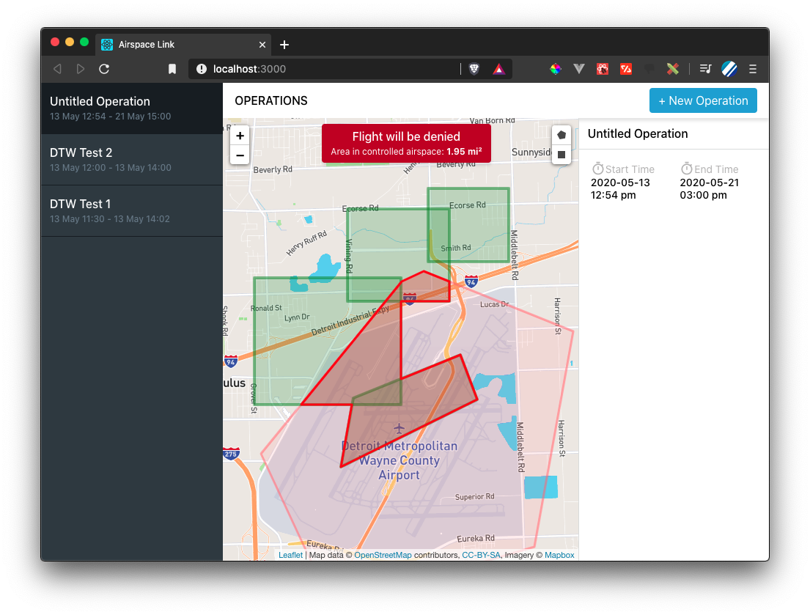

# Airspace Link | Steven Olthoff

## Run the project

### Start the Back-End

1. Clone the [back-end](https://github.com/stevenwilliamolthoff/airspace-backend).

2. `cd airspace-backend`

3. `docker-compose up`

### Start the Front-End

1. Clone the front-end (this repo).

2. `cd airspace`

3. `npm i`

4. `npm run start`

5. Open `localhost:3000`

## Approach

### The Dashboard

#### Layout

Upon loading the dashboard, a familiar layout will appear: On the left is a list of flight operations. To the right is a map centered on the Detroit airport. Controlled airspace is drawn in a light red.

#### Create an Operation

To create a new operation, click the button labelled "New Operation". A panel on the right will open. Here, you can view and edit the title and times of the operation. To begin editing a field, click it. Edits are automatically saved.

To begin drawing the shapes for a flight, click on the drawing buttons. These buttons appear near the top-left edge of the right panel. If a drawn shape intersects with controlled airspace, the intersection is displayed in a bright red. Contiguous intersections are automatically merged.

After drawing flight shapes, a mesage will be displayed at the top of the map indicating whether the flight will be accepted or rejected, along with the number of squared miles of intersection with controlled airspace.

#### Edit an Operation

To view an existing operation, click on an item in the operations list. From here, you can edit the operation in the same way as before.

### Model

There is a single data model: operations. An operation is a plan for a flight. The properties of an operation include a title, GeoJson, and start and end times. These properties can be found in the table mapping in `airspace-backend/src/entities/Operations.ts`.

## Ideas

- Handle arbitrary number of controlled airspace areas
- View other scheduled flights in the Airspace Link system
- Map overlay: residential zones
- Ability to scroll through time to see how zones on the map change throughout the day
- User inputs destinations and a route is suggested
- Show land elevation
